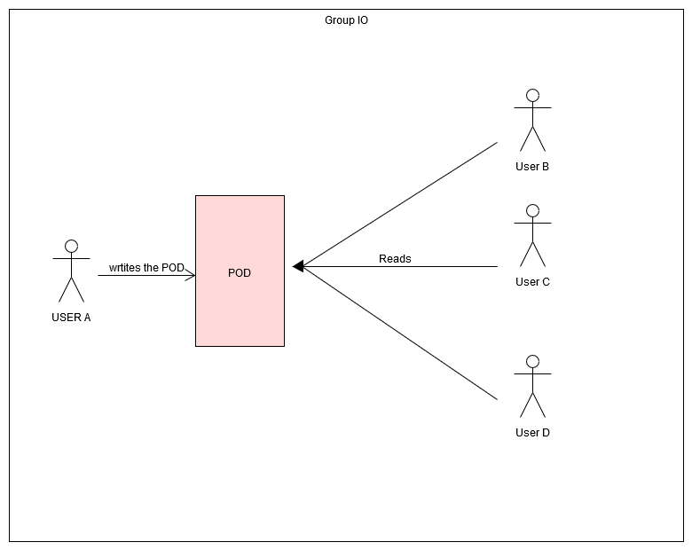

[[section-scope-and-context]]
== System Scope and Context

The DeChat will be supported by some partners to allow real time interaction
or isolation from external viewers.
Here we will describe the context (technical and business) and the scope of our decentralized chat
trying to adjust as better as possible the first version of our chat.

=== Business Context

==== Users
Users can chat privately (messages aren't registered in a server) 
with others using their own pod (SOLID credentials for any client)  

==== SOLID POD
Each user's data will be stored in their own personal POD to guarantee the ownership of their data.

==== Browser
DeChat is client side, it depends on the browser to be run. Multi-browser compatibility is imperative.

.*Overview Business diagram*
[#img-overviewbusinessdiagram]

=== Technical Context

==== Backend
The app uses SOLID server, through PODs.
A POD is like a key for an user. 
It detemines who can get a content, as messages, avoiding unwanted accesses from external people.
This way we will get the final task, a decentralized chat.

We can distinguish among two different contexts:
.*Reading context*
To describe it better we are going to use an iteration diagram between the Chat module and the ChatReader one.
[#img-overviewreadcontext]
image::./diagrams/03-readingContext.png[overviewreadcontext]

.*Writting context*
As we have done previously, It is going to be represented in the next diagram.
[#img-overviewwrittingcontext]

.*Group creation context*
A group is composed by some elements:
	- Group list(/group/groups.txt): All groups are registered there. It is token as the index for the group creation if doesn't exist
	- Folder (/dechat_es1b/groupID): Contains the messages file and Info file.
	- Info file (/dechat_es1b/groupID/info.txt): Contains group info, in owner's folder is accessible by every participant. In other for the owner and the user. Oriented to delete participants in the future.
	- Message file (/dechat_es1b/groupID/messages.txt): Contains the list of messages of a user. It is accessible by every participant.
To ilustrate the I/O context we bring you this diagram:
[#img-overviewgroup]

	

.*Group load context*
When we start the app, some functions run in background.
These are represented here:
[#img-overviewloadgroups]

==== Frontend 
The frontend will be a SPA (Single page application) in which the user will make all of his interactions, which will be the authentication and the chatting itself.
The application must interact with the PODs through their HTTP API.

