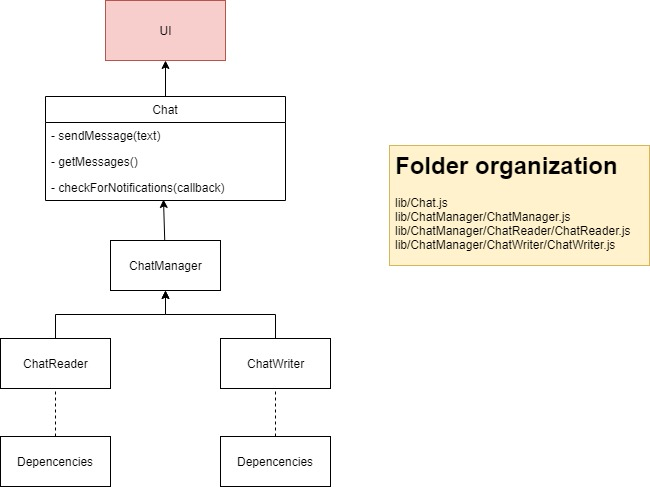

[[section-building-block-view]]
== Building Block View

=== Whitebox Overall System
.Overview diagram
[#img-overviewdiagram]
image::./diagrams/05-scopecontext.jpg[overviewdiagram]

This view illustrates the relationship between the app and the users and pods.

==== Users
The users will interact with the application through their user agent, reading and sending information from/to the DeChat.

==== Solid POD
Solid PODs store the data of their owner. Each user's messages will be stored in their own POD and nowhere else.
PODs also contain the inbox where notificiations for new messages will be sent. 

==== DeChat
The application itself allows the users to interact with each other. Messages will be read from the PODs. Sent messages will be written in the sender's POD and the receiver wil be notified in their inbox, referencing the message URI.
The application will be run client-side, in the user's browser.

=== Building Blocks: Level 2
Focusing in the DeChat app itself we have the following blocks:

[#img-level2]
.DeChat Main Blocks
image::./diagrams/05-bb_level2.png[level2]

==== UI
DeChat is presented as SPA (Single Page Application) where the user interacts through his/her browser. 
UI functionality is contained to `index.js` and isolated from the app's logic.

==== Chat
The logic of the chat is contained in its own module `chat.js`
It allows us to separate the chat itself from the presentation so the UI can be changed freely.
In SOLID, the user is the owner of his data, therefore each participant in the chat stores their messages in their own POD.
This module must recompose the whole chat from the data it gets from both PODs through the Persistence layer.

==== POD Handling
Communications with the PODs are done through the ChatManager package, a grouping of submodules that handle the persistence and data transformations needed to work with the PODs.
Each DeChat's instance will write/read both to the user's POD (write users messages, read notifications) and the target's (read their messages, send notifications).

==== Building Blocks: Level 3
.Chat interface and ChatManager main modules
[#img-uiuml]
 

==== Chat interface
The UI should be agnostic from the implementation. For that purpose we provide an interface it will communicate with, with general purpose methods such as `sendMessage`, `getMessages` or `checkForNotifications`.
Details of implementation should be irrelevant for the UI itself allowing for the reusability of the interface in a different chat domain.

==== ChatManager
The modules destined to the Read/Write operations against the PODs are split in two subfolders according to their nature, mainly represented by the `ChatReader.js` and `ChatWriter.js` modules.
Aside from this two there's a series of dependencies on both our own submodules and third party ones that collaborate towards the POD-Handling.
Some third party notable dependencies are `ldflex-query` and `solid-file-client`.

