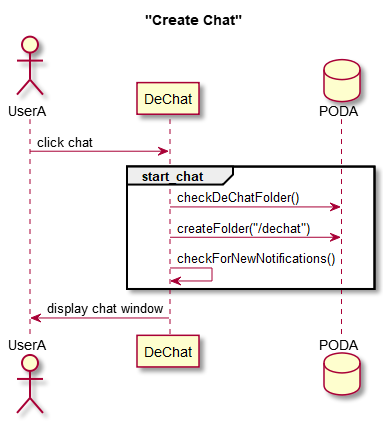
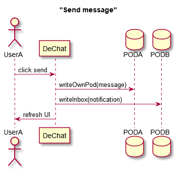

[[section-runtime-view]]
== Runtime View
Here we will discuss some important use cases.

=== Create Chat
Implying first time a user chats with friend X.

1. User clicks `Chat` in the desired friend.
2. A chat is created and a chat window is displayed

[#img-createchat]
.Create chat - Sequence diagram

The user selects a friend in the UI and clicks the Chat button. First the app checks if the containing folder for the chats is already present in the pod, otherwise it gets created.

Afterwards, a loop is set up to listen for notifications (new messages from partner) and at last the chat window is displayed.

=== Send Message
1. User types his message in the input field and clicks send
2. Message is wrote in user's POD
3. A notification is sent to partner's inbox
4. UI is refreshed

[#img-sendmessage]
.Send message - Sequence diagram

The user types his message and clicks the send button. Afterwards a message object is composed with all the relevant data (users IDs, content, timestamp).
The message is then written in its author's POD and a notification gets sent to his partner's inbox so he knows he got new messages from this particular chat.
Finally the UI is refreshed to show the new message.

=== Receive message
1. Partner sends user a message
2. A notification arrives at user's inbox
3. DeChat detects the notification
4. A visual notification is sent to the user
5. Messages get loaded and UI updated

