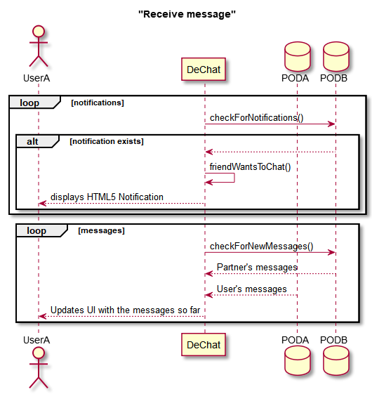

[[section-runtime-view]]
== Runtime View
Here we will discuss some important use cases.

=== Create Chat
Implying first time a user chats with friend X.

1. User clicks `Chat` in the desired friend.
2. A chat is created and a chat window is displayed

[#img-createchat]
.Create chat - Sequence diagram
image::./diagrams/06-createchat.png[createchat]

The user selects a friend in the UI and clicks the Chat button. First the app checks if the containing folder for the chats is already present in the pod, otherwise it gets created.

Afterwards, a loop is set up to listen for notifications (new messages from partner) and at last the chat window is displayed.

=== Send Message
1. User types his message in the input field and clicks send
2. Message is wrote in user's POD
3. A notification is sent to partner's inbox
4. UI is refreshed

[#img-sendmessage]
.Send message - Sequence diagram
image::./diagrams/06-sendmessage.png[sendmessage]

The user types his message and clicks the send button. Afterwards a message object is composed with all the relevant data (users IDs, content, timestamp).
The message is then written in its author's POD and a notification gets sent to his partner's inbox so he knows he got new messages from this particular chat.
Finally the UI is refreshed to show the new message.

=== Receive message
1. Partner sends user a message
2. A notification arrives at user's inbox
3. DeChat detects the notification
4. A visual notification is sent to the user
5. Messages get loaded and UI updated

[#img-receivemessage]
.Receive message - Sequence diagram

=== Starting a videocall
When the user presses the Videocall button, a connection to the TURN server is established. A PeerID is created as a result, which will identify ourselves,
and we start listening for an incoming, answer call. Once the other user is communicated our PeerID, he or she will input it into the UI and a direct
peer-to-peer connection will be made. At this point the other user will call on our peer which is listening, finally setting up a direct video call.

When the user logs in the application starts listening for notifications and when one is found the user is informed via a HTML5 Notification API who (one person or several) sent a message since the last check.

On the other hand when a user starts a chat with someone a listener is set up to gather the messages from both of the PODs every few seconds. This listener is only set for the active chat in order to increase performance (why load all chats' messages when the user will only be using one at once?). If the user changes to a different chat the listener is released and a new one is set for the new chat.

