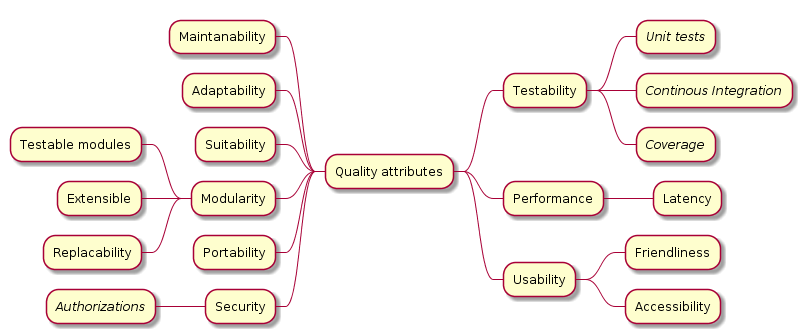

[[section-quality-scenarios]]
== Quality Requirements

_Testability_::
The app should be testable, as automated as possible with the use of Unit Testing and CI where applicable.

_Performance_::
The app must perform within reasonable levels of latency

_Usability_::
The app must be user friendly and should have a comfortable learning curve. It is imperative that the user doesnt need to waste time figuring out how to use the app

_Maintainability_::
We must produce clean and organized code so further work on the app is as easy as possible.

_Adaptability_::
The app must be flexible enough to allow changes and extensions easily in an environment of continous changes and growing requirements.

_Suitability_::
The app must fit what the stakeholders expect from a chat first and foremost.

_Modularity_::
The app have to be a set of modules. Some advanatges by using modules are:
* Singly testability, every module will be tested 
* Extensibility, adding another services in a simple way -only modifying new service related parts-.
* Easy replacement (see adaptablity section), having differentiaded modules we may facilitate the interchage between similar choices 
-eg. in a project that uses a database change a relational one by a non-relational using the adapter patern-. 

_Portability_::
The app must be used in any operating system as long as it has a web browser.

=== Quality Tree
[#img-mindmap]
.Quality attributes

=== Quality Scenarios
==== Usage Scenarios
The following scenarios has been tested using Cucumber as teachers have requested.

_List friends_::
When we are start using DeChat app, after login, user's friends should be listed on.
For example:
When My friends got listed after press List Friends button I can find my friend Alberto there.

_Get a notification_::
We want to check if a notification pops up helping us knowing when a message arrives.
When I receive a new message from a partner while i am chatting then I receive a notification.

_Know the identity of our chat-partner_::
It is very important for our users get the name of the friend who are chatting with.
For example:
When i am in the chat main page and I press the option tagged by "Pepito" i get a chat page headed by "Pepito", the name of the partner. 

_Send a message_::
Obviously, sending messages is a main part of the chat. So we want to send a message to another partner or group.
This way my friend can get immediately my message.
For example:
When I send a message "Hello Margarita, que bella flor"
Then She receives a message "Hello Margarita, que bella flor" from me

_Read a received message_::
The other main part of the chat, the messages have to persist, having them available after reading the first time.
For example:
If we are in the page that contains the chat with Jose, who ones sent me "Hi friend", we can read the message "Hi friend"
as far as eg. we don´t delete the chat.

[role="arc42help"]
****
TBD
****
