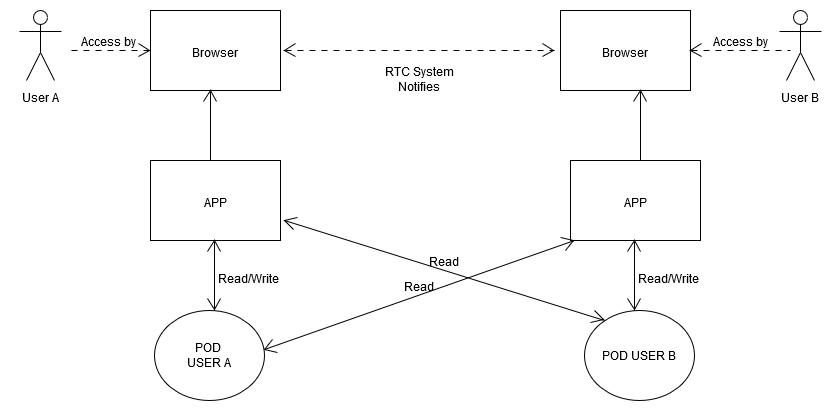
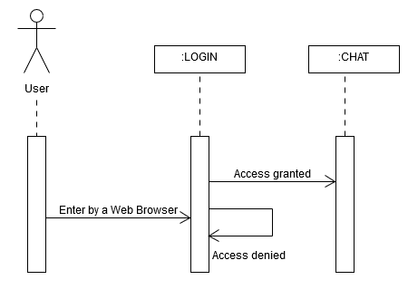

[[section-scope-and-context]]
== System Scope and Context

[role="arc42help"]
****
The DeChat will be supported by some partners to allow real time interaction
or isolation from external viewers.
Here we will describe the context (technical and business) and the scope of our decentralized chat
trying to adjust to the maximun the first version of our chat.
****

=== Business Context

[role="arc42help"]
****
.*Users*
Users can chat privately, messages aren´t registered in a server, 
with others using their own pod (SOLID credentials for any client)  

.*RTC Service*
Allows real time communication providing an API

.*SOLID*
Decentralized server to allow communication interchange

.*Overview Business diagram*
[#img-overviewdiagram]

****

=== Technical Context

[role="arc42help"]
****
.*Backend*
The app uses SOLID server, through PODs.
A POD is like a key for an user. 
It detemines who can get a content, as messages, avoiding unwanted accesses from external people.
This way we will get the final task a decentralized chat.
****

.*Frontend* 

DeChat may be composed, at least, by two different components.
* Login: Identify the user to been able to chat.
* Chat: The chat itself, allows users interaction with each other.

.Overview Technical diagram
[#img-overviewdiagram]
